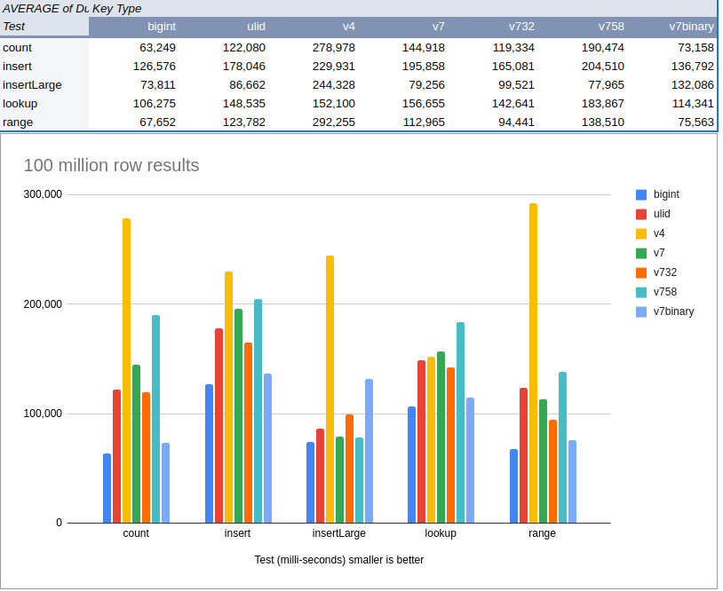

# [Databases: Beyond Auto Increment](https://medium.com/@andrew_10845/databases-beyond-auto-increment-2101953fefc3)

**Note:** *This article has been updated to run tests concurrently and against 100 million rows rather than 10 million and write rows into the full table rather than against empty tables to be more realistic of the performance under load. It is now tested only against a constrained database with 2 cores and 4 GB of memory.*

*The original article as is remains below the revised version.*

In Domain Driven Design we need to create entities that are always in a consistent state. We therefore cannot use Auto Increment or Sequences for their primary key (id). We need a UUID or something which can be generated in process that provides guarantees of uniqueness. In this article we will look at the performance of a few options.

One option is to use SnowFlake Ids. These were popularised by Twitter. Unfortunately they require a server to issue a partition ID or a machine ID to the producer. At most scales this does not seem acceptable.

We will therefore compare the following with auto incrementing big integers.

- UUID version 4
- UUID version 7
- UUID version 7 Base32 encoded
- UUID version 7 Base58 encoded
- UUID version 7 binary encoded
- ULID

#### Samples

```bash
Auto-increment: 1000000000000000000
Next Auto-increment: 1000000000000000001

UUID v4: 5f02ebf4-66e3-4e77-ac2b-7c6efdfababe
UUID v4 (hex): 5f02ebf466e34e77ac2b7c6efdfababe

UUID v7: 0701910c-c315-d70d-b70a-07e459e687ea
UUID v7 (hex): 0701910cc315d70db70a07e459e687ea
UUID v7 Base32: A4AZCDGDCXLQ3NYKA7SFTZUH5I
UUID v7 Base58: sBMGh4XauunCbyHDPDRu3
UUID v7 Binary: b'\x07\x01\x91\x0c\xc3\x15\xd7\r\xb7\n\x07\xe4Y\xe6\x87\xea'
UUID v7 Binary (hex): 0701910cc315d70db70a07e459e687ea

ULID: 01J46C65ER91XWG8E503GJQZ7V
ULID (bytes): b'\x01\x91\x0c\xc3\x15\xd8H{\xc8!\xc5\x00\xe1+\xfc\xfb'

Auto-increment:
1000000000000000000
1000000000000000001
1000000000000000002
1000000000000000003
1000000000000000004

UUID v4:
e8b8a2e3-9a3f-4e17-9a20-8c9b8d9f8c1a
f7c6b5a4-3d2e-4f1g-9h8i-7j6k5l4m3n2o
a1b2c3d4-5e6f-7g8h-9i0j-1k2l3m4n5o6p
p9o8n7m6-l5k4-j3i2-h1g0-f1e2d3c4b5a6
q1w2e3r4-t5y6-u7i8-o9p0-a1s2d3f4g5h6

UUID v7:
0189db75-bd91-7d87-8000-629c2d12b6bc
0189db75-bd91-7f1f-8000-d49ba01eca0d
0189db75-bd91-7fb7-8000-81b9e6107afe
0189db75-bd91-804f-8000-2f0c1c0c8aef
0189db75-bd91-80e7-8000-cc34110793f0

UUID v7 Base32:
AGHNNW6TSHM4PYAAGKOCFQVLFO
AGHNNW6TSHM74YCAOFMLAPRBA4
AGHNNW6TSHM76O4AQHNY4EBPPQ
AGHNNW6TSHM8AJ4AFJAMCQEIXO
AGHNNW6TSHM8BXYA2TBBCF4P6A

UUID v7 Base58:
e6pBLmMv3cCmjwz2pnLvRk
e6pBLmMvm9gRYNZT66e74o
e6pBLmMvvNDXrnj24qLm6Y
e6pBLmMw3tHdnf8cAcMXda
e6pBLmMwCoA7qs7eZg3YPH

UUID v7 Binary (hex representation):
0189db75bd917d8f800012f2b99a8be1
0189db75bd917f278000e7c5c0c984f2
0189db75bd917fbf8000bb8f85109503
0189db75bd9180578000909aa010a614
0189db75bd9180ef80006e23f1109725

ULID:
01H6KFATQ0N3HTDM1QJQ86DRMH
01H6KFATQ1GWA94QKCF2JZSFX6
01H6KFATQ29NWDE7JNFMW0EE15
01H6KFATQ31E2WNSBMGZK5DAQC
01H6KFATQ3TAAAGYX2QS48Q2JH
```


# UUID version 4

UUIDs all have a format like ‘00000105–932c-4e83–98bd-fd3cbb92006a’. Depending on the version each segment is derived using a different algorithm. They are 36 characters long and will therefore occupy more disk space than a big integer.

Unfortunately the UUID V4 version is not lexically ordered. Relational database engines will have a harder time inserting the indexes into storage and range queries will suffer from the locality problem. We will see what practically this may means for our queries.

# UUID version 7

It follows the standard UUID format (RFC 1142). However the first part of the UUID is timestamp based and is lexically ordered. Since they are ordered means inserts are faster. Being a UUID they are 36 characters.

# UUID V7 Base 32

We can use UUID V7 but encode it as Base32. This will reduce the size to 26 characters and we will lose the dashes. It remains lexically ordered. Base32 is more human readable.

# UUID V7 Base 58

We can use UUID V7 but encode as Base58. This will reduce the size to 22 characters and we will lose the dashes. Base58 is used rather than 64 as there are 58 characters amongst the various UTF8 character sets which are stable. It remains lexically ordered. Base 58 is smaller is less human readable.

# UUID V7 Binary Encoded

We can use UUID V7 and binary encode for 16 byte size but it is **NOT** longer lexially ordered.

# ULID

Ulids were created before UUID version 7. UUID version 7 is a ULID but with version and variant fields. ULID is 26 characters and lexically ordered.

# Setup

- Create a table with a primary key, a random name and a timestamp for each type of primary key type.
- Seed each table with **100 million rows.**
- Store a lookup key for every 1000 rows seeded in the database for each type. This will be used to store lookup values without fetching them from the target database.
- Create a table to store the results of the tests.
- Create a Laravel console command to run the tests and write the results to a results table.
- Use only database calls i.e. no query builder.
- Don’t start the timer in any code setup phase e.g. fetching lookup values. These won’t be timed to limit the time takes to database operations.

# Tests

We will perform the following tests using MySQL running via Docker compose.

```
version: '3'
services:
  db:
    image: mysql:latest
    ports:
      - 3306:3306
    environment:
      MYSQL_ROOT_PASSWORD: test_password
      MYSQL_DATABASE: test_primary_key
      MYSQL_USER: test_user
      MYSQL_PASSWORD: test_password
    deploy:
      resources:
        limits:
          cpus: "2.0"
          memory: 4000M
    volumes:
      - ./db_data:/var/lib/mysql
```

- The computer is restarted after every test
- The Symfony UUID component to generate the UUID/ULIDs.
- There are 4 test types. Tests types are all run concurrently. Each test has a different number of concurrent instances
- All in all 22 tests are run concurrently
- The average for each is presented in the graph showing the results.

**Insert**

Run 10 instances concurrently. Each instance generates 10,000 insert row and then inserts them 1 at a time. The time taken is measured against the time to insert the records and does not include setup time.

**InsertLarge**

This test is the only test that runs by itself and not concurrently with the other tests. 20 instances of the test are run for 200,000 total records inserted. It demonstrates the effects of the index not naturally being sorted.

**Range Select**

A random offset is generated and 5000 records from the offset are selected. 4 instances are run concurrently. This should surface locality issues. The query is shown below.

```
SELECT * FROM {TABLE_NAME} 
WHERE order_date >= {LOOKUP_ORDER_DATE) 
ORDER BY order_date ASC
LIMIT 1000
OFFSET {RANDOM_OFFSET}
```

## Lookup

Run 10 instances concurrently. Fetching 10,000 records from a random offset in the lookup database. Loop over each value in our lookup list and fetch it.

```
SELECT * FROM {TABLE_NAME} WHERE id = ?
```

This will see what effect the size and shape of the index has on the lookup.

**Count (\*)**

Run 4 instances concurrently. SELECT count(*) is a surprisingly slow operation. Each entry in the primary key index must be counted. We will see the effect the various index types have on count performance.

```
SELECT count(*) FROM {TABLE_NAME}
```

# Results



- It is clear the UUID V4 is much slower than the other UUID variants. It performed better than expected in inserts. If inserts are sustained over longer periods its performance drops off. It is also noted that seeding a 100 million rows with a UUID V4 primary key takes at least 6 times as long as the other variants due to the keys being unordered and B-Tree lookups taking much longer.
- Binary encoded UUID V7 performs will. But since it is unordered it suffers in insert performance as searching the index will be less efficient as the time ordered varieties.
- UUID V7 Base 32 and ULID variants appear to be the best compromise.

# Conclusion

Auto incrementing IDs are fastest but there are good reasons to choose UUIDs now that time ordered variants are available.

# Links

**Source**: https://github.com/andrew-belac/benchmark-primary-key
**Results**: https://docs.google.com/spreadsheets/d/1wycaBzCwhDV_obmu2HZCvtt4qFj2GNYL75YoKUnZK6o/edit?usp=sharing